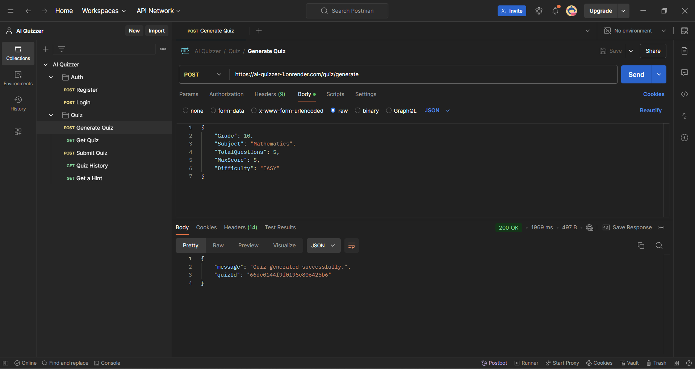
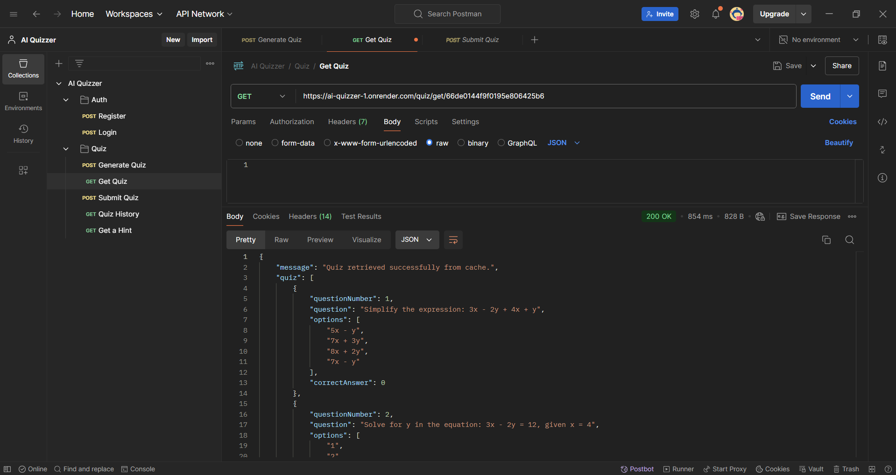

# AI Quizzer

## Features

- **Generate Quiz**: Create quizzes with custom parameters using AI.
- **Submit Quiz**: Submit answers for a quiz and receive feedback.
- **Quiz History**: Retrieve and filter the history of quiz attempts.
- **Hints**: Get hints for specific quiz questions.
- **User Authentication**: Register and log in users.

## Technologies Used

- Node.js
- Express.js
- MongoDB
- Redis (for caching)
- Groq (for AI-based quiz generation)
- JWT (for authentication)

## Deployed Backend

The backend is deployed on Render and can be accessed [here](https://ai-quizzer-1.onrender.com).

## Getting Started

### Prerequisites

- Node.js
- Docker (for containerization)
- Redis (cloud instance)

### Environment Variables

Create a `.env` file in the root of the project with the following variables:

```plaintext
MONGO_URI=<MongoDB URI>
JWT_SECRET=<JWT secret>
GROQ_API_KEY=<Groq API key>
EMAIL=<Email for sending emails>
PASSWORD=<App Password for sending emails>
REDIS_URL=<Redis URL>
```

### Installation

Install the necessary dependencies:

```bash
npm install
```

### Running the Application

Start the application:

```bash
npm start
```

## API Documentation

The Postman API documentation can be found [here](https://documenter.getpostman.com/view/28333089/2sAXjRWq1j)

## Screenshots

### Register


### Login


### Generate Quiz



### Get a Quiz


### Get quiz from redis (cached - the message is quiz retrieved from cache)



### Submit Quiz


### Get Quiz History


### Get Hints


